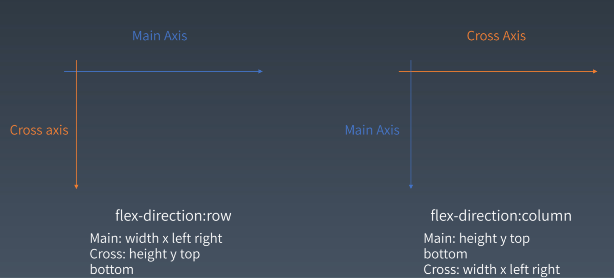

# 每周总结可以写在这里

#### flex布局
mainSize：主轴
mainStart: 主轴起点 left / right / top / bootom
mainEnd :主轴终点 left / right / top / bottom
mainSign :主轴符号位，用于 是否 reverse +1 / -1
mainBase :主轴开始的位置 0 / style.width
crossSize :交叉轴size width / height
crossStart:交叉轴坐标起点 left / right / top / bottom
crossEnd :交叉轴坐标终点 left / right / top / bottom
crossSign :交叉轴符号位，用于 是否 reverse +1 / -1
crossBase :交叉轴开始的位置 0 / style.width

#### CSS知识复习（见static文件夹内的CSS.xmind）

包含以下方面

###### 选择器知识
###### CSS @规则

#### 引入images时报错
